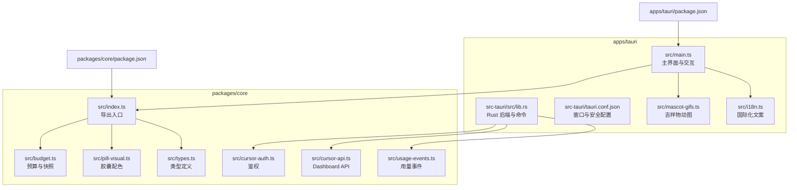
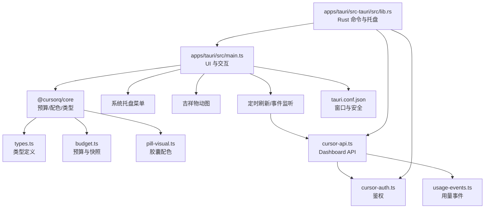
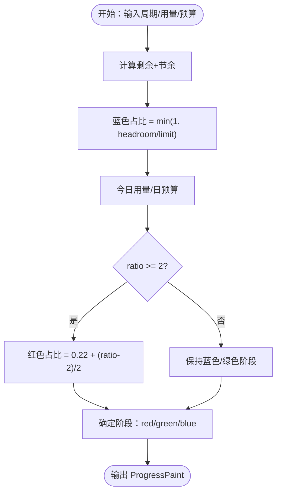
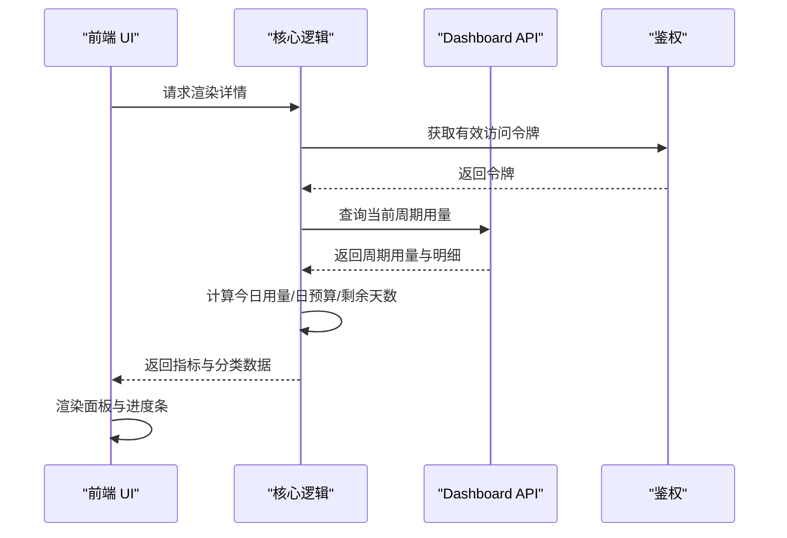
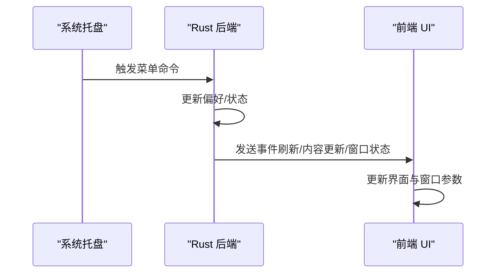
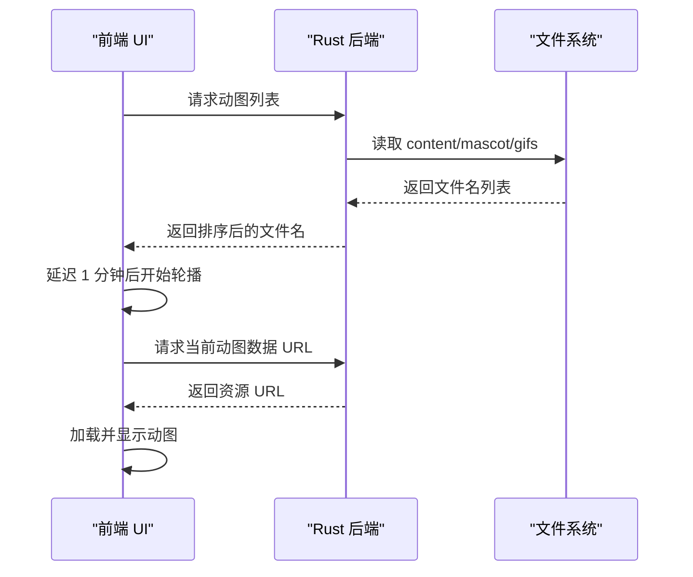
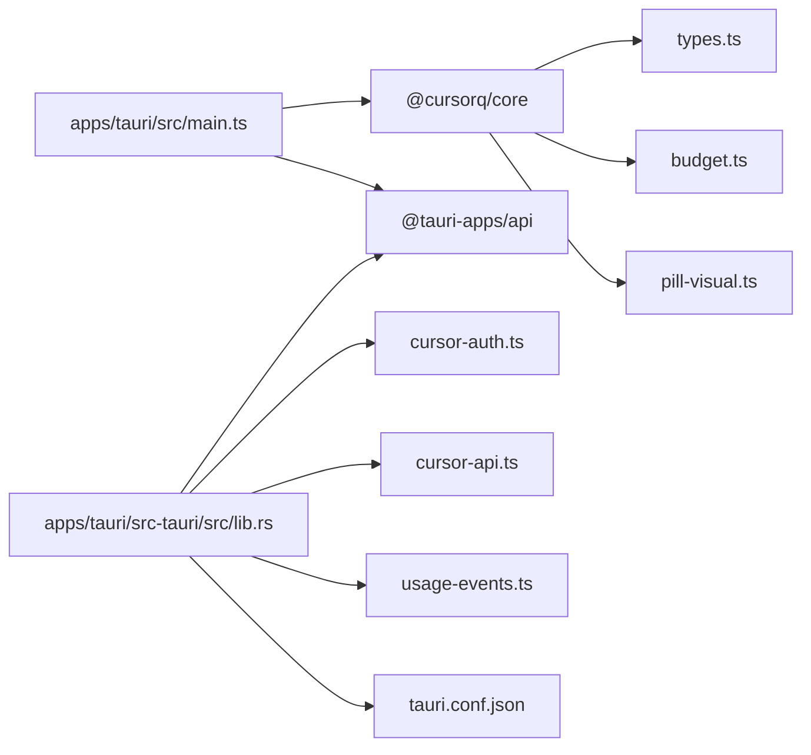

# 项目概述

<cite>
**本文引用的文件**
- [README.md](file://README.md)
- [main.ts](file://apps/tauri/src/main.ts)
- [mascot-gifs.ts](file://apps/tauri/src/mascot-gifs.ts)
- [i18n.ts](file://apps/tauri/src/i18n.ts)
- [tauri.conf.json](file://apps/tauri/src-tauri/tauri.conf.json)
- [Cargo.toml](file://apps/tauri/src-tauri/Cargo.toml)
- [main.rs](file://apps/tauri/src-tauri/src/main.rs)
- [lib.rs](file://apps/tauri/src-tauri/src/lib.rs)
- [budget.ts](file://packages/core/src/budget.ts)
- [pill-visual.ts](file://packages/core/src/pill-visual.ts)
- [types.ts](file://packages/core/src/types.ts)
- [cursor-auth.ts](file://packages/core/src/cursor-auth.ts)
- [cursor-api.ts](file://packages/core/src/cursor-api.ts)
- [usage-events.ts](file://packages/core/src/usage-events.ts)
- [package.json](file://apps/tauri/package.json)
- [package.json](file://packages/core/package.json)
- [TAURI_DEV_SETUP.md](file://docs/TAURI_DEV_SETUP.md)
</cite>

## 目录
1. [简介](#简介)
2. [项目结构](#项目结构)
3. [核心组件](#核心组件)
4. [架构总览](#架构总览)
5. [详细组件分析](#详细组件分析)
6. [依赖关系分析](#依赖关系分析)
7. [性能考量](#性能考量)
8. [故障排查指南](#故障排查指南)
9. [结论](#结论)
10. [附录](#附录)

## 简介
CursorQ 是一个基于 Tauri 2 的桌面胶囊挂件应用，专注于 Cursor 订阅用量的可视化与提醒。它在屏幕顶部以“药丸状”胶囊的形式展示周期余量、今日预算与状态文案，并通过系统托盘提供显示/隐藏、语言切换、置顶、开机启动、刷新与远程内容同步等功能。项目采用“不拦截、仅读取”的设计原则，通过读取本机 Cursor 登录态与 Dashboard 数据进行提醒与可视化，不修改或影响 Cursor 的网络请求。

- 核心价值
  - 低侵入式：仅读取 Cursor 本地登录态与 Dashboard 数据，不拦截或篡改网络请求。
  - 实时可视化：以胶囊进度条直观反映“周期剩余+节余银行”与“今日用量 vs 日预算”的关系。
  - 人性化交互：系统托盘菜单、吉祥物动图轮播、双语文案与本地化、调试模式等。
  - 可扩展内容：支持内置与远程内容合并，便于社区贡献与个性化定制。

- 目标用户
  - 使用 Cursor 的个人开发者与团队成员，关注订阅用量与预算控制。
  - 偏好轻量、无干扰、可随时折叠的桌面挂件的用户。

- 与类似工具的区别
  - 专注 Cursor 生态：直接对接 Cursor Dashboard 接口与本地数据库，确保数据一致性。
  - 仅读取策略：不修改任何数据，降低风险与兼容性问题。
  - 本地化与内容生态：内置中英文案与吉祥物，支持远程内容同步与覆盖策略。

**章节来源**
- [README.md:1-130](file://README.md#L1-L130)

## 项目结构
项目采用多包（monorepo）结构，分为前端主程序（apps/tauri）、核心逻辑（packages/core）与文档脚本（scripts/docs）等模块。apps/tauri 为 Tauri 2 主程序，负责窗口、托盘、事件与 UI 渲染；packages/core 提供 Cursor 鉴权、API 调用、预算计算、进度条配色与类型定义等纯前端/核心逻辑。

**图表来源**
- [main.ts:1-711](file://apps/tauri/src/main.ts#L1-L711)
- [lib.rs:1-722](file://apps/tauri/src-tauri/src/lib.rs#L1-L722)
- [tauri.conf.json:1-48](file://apps/tauri/src-tauri/tauri.conf.json#L1-L48)
- [budget.ts:1-274](file://packages/core/src/budget.ts#L1-L274)
- [pill-visual.ts:1-79](file://packages/core/src/pill-visual.ts#L1-L79)
- [types.ts:1-140](file://packages/core/src/types.ts#L1-L140)
- [cursor-auth.ts:95-162](file://packages/core/src/cursor-auth.ts#L95-L162)
- [cursor-api.ts:89-209](file://packages/core/src/cursor-api.ts#L89-L209)
- [usage-events.ts:123-178](file://packages/core/src/usage-events.ts#L123-L178)
- [package.json:1-22](file://apps/tauri/package.json#L1-L22)
- [package.json:1-32](file://packages/core/package.json#L1-L32)

**章节来源**
- [README.md:98-119](file://README.md#L98-L119)
- [package.json:1-22](file://apps/tauri/package.json#L1-L22)
- [package.json:1-32](file://packages/core/package.json#L1-L32)

## 核心组件
- 胶囊进度条与配色
  - 胶囊颜色与宽度由“周期剩余+节余银行”与“今日用量 vs 日预算”共同决定，当今日用量超过日预算的 2 倍时，胶囊从左向右出现红色警示区域。
  - 配色计算集中在核心模块，保证 UI 与逻辑的一致性。

- 用量详情面板
  - 展示计费周期、今日/周期用量、日预算、剩余天数等指标；按 API/Auto 分类分组，可展开查看模型明细。
  - 面板中的“总量/今日已用/剩余天数”等进度条仅作参考；胶囊红条仅由“今日 vs 日预算”触发。

- 系统托盘
  - 提供显示/隐藏胶囊、中/英文、总是置顶、开机启动、立即刷新、同步远程文案/动图、退出等菜单项。
  - 菜单项状态与行为由 Rust 后端维护，并通过事件通知前端更新 UI。

- 吉祥物动图
  - 启动显示占位图，约 1 分钟后开始轮播 content/mascot/gifs 内的动图（每 20 分钟切换）；双击吉祥物可手动切换。
  - 支持 GIF/WebP/PNG 等格式，动态加载与缓存优化。

- 文案与本地化
  - 支持中英双语文案，文案来源为内置 content/copy 与远程内容合并（可选）。
  - 文案池支持单击切换与轮播，提升使用体验。

**章节来源**
- [README.md:5-12](file://README.md#L5-L12)
- [pill-visual.ts:1-79](file://packages/core/src/pill-visual.ts#L1-L79)
- [main.ts:174-188](file://apps/tauri/src/main.ts#L174-L188)
- [main.ts:216-278](file://apps/tauri/src/main.ts#L216-L278)
- [mascot-gifs.ts:1-164](file://apps/tauri/src/mascot-gifs.ts#L1-L164)
- [i18n.ts:1-89](file://apps/tauri/src/i18n.ts#L1-L89)

## 架构总览
整体架构采用“前端 UI（TypeScript/Vue/Vite）+ 后端逻辑（Rust/Tauri）+ 核心算法（TypeScript）”的分层设计。前端负责渲染与交互，后端负责系统集成（托盘、窗口、权限、自动启动等），核心算法负责用量计算与配色逻辑。

**图表来源**
- [main.ts:1-711](file://apps/tauri/src/main.ts#L1-L711)
- [lib.rs:1-722](file://apps/tauri/src-tauri/src/lib.rs#L1-L722)
- [tauri.conf.json:1-48](file://apps/tauri/src-tauri/tauri.conf.json#L1-L48)
- [budget.ts:1-274](file://packages/core/src/budget.ts#L1-L274)
- [pill-visual.ts:1-79](file://packages/core/src/pill-visual.ts#L1-L79)
- [types.ts:1-140](file://packages/core/src/types.ts#L1-L140)
- [cursor-auth.ts:95-162](file://packages/core/src/cursor-auth.ts#L95-L162)
- [cursor-api.ts:89-209](file://packages/core/src/cursor-api.ts#L89-L209)
- [usage-events.ts:123-178](file://packages/core/src/usage-events.ts#L123-L178)

## 详细组件分析

### 胶囊进度条与配色（核心算法）
- 输入：周期额度、剩余金额、节余银行、今日用量、日预算、剩余天数、节奏压力等。
- 输出：胶囊蓝/绿/红三段比例与阶段（phase），用于 UI 渲染。
- 关键规则
  - 蓝色占比 = min(1, (剩余+节余)/额度)，从右向左收缩表示消耗。
  - 当今日用量 ≥ 2× 日预算时，出现红色警示区域，比例随超支程度增加。
  - 面板“总量/剩余天数”等进度条仅作参考，不影响胶囊颜色。

**图表来源**
- [pill-visual.ts:29-63](file://packages/core/src/pill-visual.ts#L29-L63)
- [budget.ts:243-272](file://packages/core/src/budget.ts#L243-L272)

**章节来源**
- [pill-visual.ts:1-79](file://packages/core/src/pill-visual.ts#L1-L79)
- [budget.ts:1-274](file://packages/core/src/budget.ts#L1-L274)

### 用量详情面板（UI 与交互）
- 面板包含三项指标：
  - 总量：周期已用百分比，与 Dashboard 对齐。
  - 今日：今日用量与日预算的对比，宽度上限 100%。
  - 剩余天数：周期剩余天数紧迫度，短=宽松，长=紧迫。
- 分类与模型明细：
  - 按 API/Auto 分类聚合；可展开查看具体模型用量。
  - 忽略默认/未知模型，仅展示真实模型。

**图表来源**
- [main.ts:216-278](file://apps/tauri/src/main.ts#L216-L278)
- [cursor-api.ts:89-209](file://packages/core/src/cursor-api.ts#L89-L209)
- [cursor-auth.ts:95-162](file://packages/core/src/cursor-auth.ts#L95-L162)

**章节来源**
- [main.ts:319-415](file://apps/tauri/src/main.ts#L319-L415)
- [cursor-api.ts:152-209](file://packages/core/src/cursor-api.ts#L152-L209)

### 系统托盘（Rust 后端）
- 菜单项与行为
  - 显示/隐藏胶囊、中/英文、总是置顶、开机启动、立即刷新、同步远程内容、退出。
  - 状态变更通过事件通知前端，前端更新 UI 并持久化偏好设置。
- 窗口与平台集成
  - Windows 下通过 DWM 处理窗口形状，避免白边。
  - 窗口为无边框透明圆角窗，始终置顶且可跳过任务栏。

**图表来源**
- [lib.rs:680-713](file://apps/tauri/src-tauri/src/lib.rs#L680-L713)
- [tauri.conf.json:13-30](file://apps/tauri/src-tauri/tauri.conf.json#L13-L30)

**章节来源**
- [lib.rs:1-722](file://apps/tauri/src-tauri/src/lib.rs#L1-L722)
- [tauri.conf.json:1-48](file://apps/tauri/src-tauri/tauri.conf.json#L1-L48)

### 吉祥物动图（前端资源与加载）
- 启动占位图：default.png，1 分钟后开始轮播。
- 轮播策略：每 20 分钟切换一张；双击吉祥物手动切换。
- 加载机制：优先通过 Tauri 命令加载内置资源，开发模式回退到 public 目录。

**图表来源**
- [mascot-gifs.ts:86-125](file://apps/tauri/src/mascot-gifs.ts#L86-L125)
- [mascot-gifs.ts:145-159](file://apps/tauri/src/mascot-gifs.ts#L145-L159)

**章节来源**
- [mascot-gifs.ts:1-164](file://apps/tauri/src/mascot-gifs.ts#L1-L164)

### 国际化与文案（前端）
- 支持中英双语，文案来源于内置 content/copy 与远程内容合并。
- 提供“连点三下”进入调试模式的提示文案，以及“单击切换文案/双击展开详情”等交互提示。

**章节来源**
- [i18n.ts:1-89](file://apps/tauri/src/i18n.ts#L1-L89)

## 依赖关系分析
- 前端依赖
  - @cursorq/core：核心逻辑与类型定义。
  - @tauri-apps/api：Tauri 前端 API（事件、窗口、调用命令）。
  - Vite/TypeScript：构建与类型检查。
- 后端依赖（Rust）
  - tauri、tauri-plugin-shell、tauri-plugin-autostart：窗口、托盘、自动启动。
  - reqwest（阻塞 + rustls）、chrono、which、base64：HTTP、时间、系统工具、编码。
  - windows（DWM 相关）：Windows 平台窗口处理。
- 核心模块依赖
  - sql.js：读取 Cursor 本地数据库。
  - 类型与算法：types.ts、budget.ts、pill-visual.ts。

**图表来源**
- [main.ts:1-711](file://apps/tauri/src/main.ts#L1-L711)
- [lib.rs:1-722](file://apps/tauri/src-tauri/src/lib.rs#L1-L722)
- [package.json:12-15](file://apps/tauri/package.json#L12-L15)
- [package.json:24-26](file://packages/core/package.json#L24-L26)
- [tauri.conf.json:1-48](file://apps/tauri/src-tauri/tauri.conf.json#L1-L48)

**章节来源**
- [package.json:1-22](file://apps/tauri/package.json#L1-L22)
- [package.json:1-32](file://packages/core/package.json#L1-L32)
- [Cargo.toml:15-33](file://apps/tauri/src-tauri/Cargo.toml#L15-L33)

## 性能考量
- 胶囊窗口高度与展开动画
  - 采用“一次性设定高度”的方式避免 WebView 卷轴动画触发白边，提升视觉稳定性。
- 资源加载与缓存
  - 动图轮播使用定时器与延迟启动，减少启动时的 IO 压力；图片加载失败时回退到本地占位图。
- 网络请求与重试
  - Dashboard API 与用量事件接口采用分页拉取与降级策略，避免一次性请求过大导致阻塞。
- 窗口与平台优化
  - Windows 下通过 DWM 处理窗口形状，减少边缘白边；透明圆角窗减少系统主题对窗口底色的影响。

**章节来源**
- [main.ts:492-522](file://apps/tauri/src/main.ts#L492-L522)
- [mascot-gifs.ts:101-119](file://apps/tauri/src/mascot-gifs.ts#L101-L119)
- [cursor-api.ts:173-209](file://packages/core/src/cursor-api.ts#L173-L209)

## 故障排查指南
- 环境与依赖
  - Windows 需要 MSVC 工具链与 WebView2 运行时；Rust 工具链需切换为 MSVC。
  - 开发命令建议使用项目提供的脚本或 npm run dev。
- 常见问题
  - “未登录 Cursor”：前端检测到未登录时会提示“请先登录 Cursor”，需先在 Cursor 桌面版登录。
  - “刷新失败”：前端会在 UI 上提示错误信息，可尝试立即刷新或检查网络。
  - “黑角/白边”：Windows 下通过 DWM 处理窗口形状；若仍存在，可调整窗口位置或重启应用。
- 日志与定位
  - 日志路径位于 .data/logs/cursorq.log（开发环境），可用于定位问题。

**章节来源**
- [TAURI_DEV_SETUP.md:1-143](file://docs/TAURI_DEV_SETUP.md#L1-L143)
- [main.ts:526-560](file://apps/tauri/src/main.ts#L526-L560)
- [README.md:121-126](file://README.md#L121-L126)

## 结论
CursorQ 通过“前端 UI + Rust 后端 + 核心算法”的分层架构，在不改变 Cursor 网络请求的前提下，提供了实时、直观、可交互的订阅用量可视化方案。其简洁的设计与丰富的交互细节（托盘菜单、吉祥物动图、双语文案、调试模式）使其既适合日常使用，也便于开发者扩展与二次开发。

## 附录

### 快速开始
- 环境要求
  - Windows 10+；已安装并登录 Cursor 桌面版；Node.js 20+、Rust（MSVC 工具链）、WebView2。
- 安装与运行
  - 安装依赖：npm install
  - 构建：npm run build
  - 开发运行：npm run dev（或 scripts\dev-tauri.cmd）
- 基本使用
  - 拖动胶囊：按住胶囊约 0.5 秒或移动鼠标后开始拖动，重新定位窗口。
  - 单击吉祥物：展开/收起用量详情面板。
  - 双击胶囊：展开/收起详情面板。
  - 单击文案行：切换下一条段子/状态文案。
  - 双击吉祥物：切换下一张动图。
  - 托盘菜单：显示/隐藏胶囊、中/英文、总是置顶、开机启动、立即刷新、同步文案/动图、退出。

**章节来源**
- [README.md:14-51](file://README.md#L14-L51)
- [TAURI_DEV_SETUP.md:46-92](file://docs/TAURI_DEV_SETUP.md#L46-L92)

### 技术栈与架构选择
- 技术栈
  - 前端：TypeScript + Vite + Tauri 2（@tauri-apps/api）
  - 后端：Rust（Tauri 插件：shell、autostart）
  - 核心：TypeScript（@cursorq/core），sql.js 读取 Cursor 本地数据库
- 选择理由
  - Tauri 2：跨平台、原生体验、更小体积与更高性能；透明圆角窗与托盘能力满足产品需求。
  - Rust：系统级安全与性能，适合窗口管理、自动启动与平台集成。
  - TypeScript：强类型与模块化，便于核心算法与 UI 的解耦。

**章节来源**
- [package.json:12-15](file://apps/tauri/package.json#L12-L15)
- [Cargo.toml:15-25](file://apps/tauri/src-tauri/Cargo.toml#L15-L25)
- [package.json:24-26](file://packages/core/package.json#L24-L26)